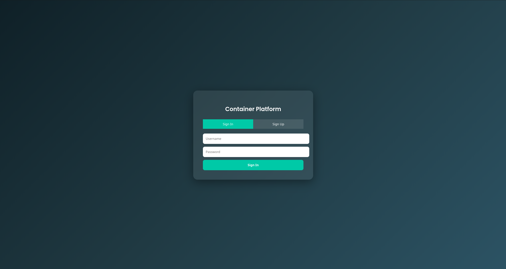
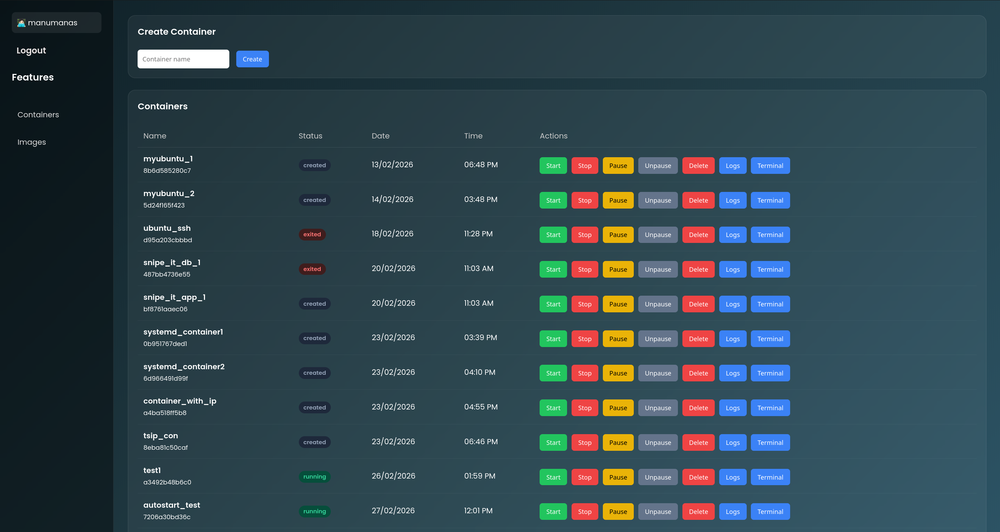
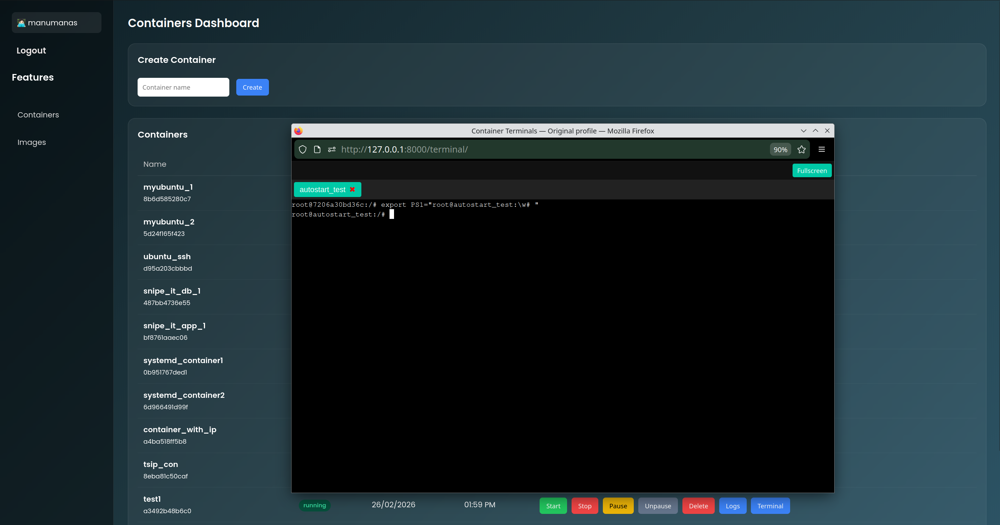
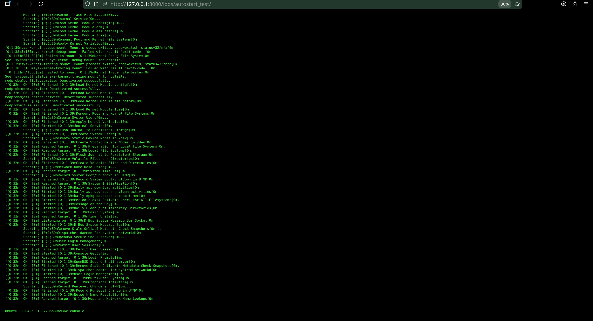

Container Management Platform (with Wireguard Automation)

Overview of the project:

This project is a web-based container management platform built using Django + Podman + Wireguard.

It allows users to:

Create and manage containers from the web browser

Automatically configure Wireguard networking in containers

Access container terminal from web UI

View live container logs

Monitor container status in real time

Auto-start containers after system reboot

Project Structure

mysite/
│
├── containers/
│   ├── models.py
│   ├── views.py
│   ├── consumers.py
│   ├── routing.py
│   ├── urls.py
│   ├── templates/
│
├── manage.py
└── settings.py

High Level Architecture of the application:

User Browser (Frontend UI)
        |
Django Web Application (Backend Server)
        |
Podman Client / Podman Socket API
        |
Podman Container Engine
        |
Containers (Ubuntu + systemd)
        |
Wireguard Configuration Inside Containers
        |
Host Wireguard Interface
        |
Connection Between Host and Containers

Features of the application:

User Authentication system

Container management (start/stop/delete , etc.) 

Browser-based terminal access 

Automatic Wireguard configuration in containers

Real-time logs streaming 

Auto-start containers after reboot 

Dynamic IP allocation

1. Authentication System:

Users can sign up and log in to access the dashboard.

Preview of the page:

2. Container Dashboard

Main interface for managing containers.

Features:

Create container

Start / Stop / Pause / Delete

Open terminal

View logs

View images

Preview of the page:

The image used to create containers is Ubuntu

When a container is created by default it comes with some installed packages:

Wireguard

SSH

Systemd

Nano

3. Container Creation Flow:

User → Dashboard → Create Container
        |
Django Backend
        |
Podman Container Created
        |
Auto-Start Enabled (systemd)
        |
Wireguard Config Generated
        |
Host Peer Updated
        |
Container Ready

4. Browser Terminal

Interactive terminal connected directly to container shell using WebSockets.

Technology used:

Django Channels

PTY

Xterm.js

Preview of the page:

5. Logs Viewer

Real-time container logs streaming using WebSockets.

Preview of the page:

6. Wireguard Automation:

Each container automatically receives:

Unique VPN IP

Private/Public key pair

Peer configuration with host

Example network:

Host:        10.10.0.1

Container 1: 10.10.0.2

Container 2: 10.10.0.3

Wireguard config is dynamically rebuilt whenever containers are added or removed.

7. Overview of each file what it does

a. Models.py

This file defines the database structure used by the application.

Basically It contains the Container model, which stores networking information required for Wireguard configuration.

Fields

name → Name of the container (unique)

Wireguard_ip → Assigned VPN IP address

public_key → Wireguard public key of the container

This database table acts as the source of truth for all Wireguard peer configurations.

b. Views.py

This is the main backend logic file and acts as the central controller of the application.

It handles both user interactions and system automation tasks.

This file is mainly responsible for:

Authentication

Container creation

Container actions

Wireguard setup

Host Wireguard Rebuild

Auto-start configuration

c. Consumers.py

This file implements WebSocket-based real-time communication using Django Channels.

There are three main consumers:

TerminalConsumer → Provides an interactive terminal session inside the container.

LogsConsumer → Streams real-time logs

StatusConsumer → Continuously monitors container status.

d. routing.py

This file defines WebSocket URL routes for Django Channels.

It maps WebSocket endpoints to the appropriate consumers.

Examples:

/ws/terminal/<container_name>/

/ws/logs/<container_name>/

/ws/status/

This acts similarly to urls.py but for WebSockets instead of HTTP.

e. urls.py

This file defines HTTP routes for the application.

It connects URLs with Django view functions.

Routes Included

Login page

Dashboard page

Logout endpoint

Terminal page

Logs viewer page

It serves as the entry point for all browser requests.

f. apps.py

This file registers the Django application configuration. i.e It informs Django about the existence of the containers app.

g. admin.py

This file is used to connect the database models to the Django admin panel. If we register models here, we can view and manage the data from the admin website.

h. Templates Folder(Frontend UI)

The templates folder contains HTML files responsible for rendering the user interface.

auth.html  —> This file provides the authentication interface for the application.

dashboard.html —> This is the main user interface of the platform. t provides container management functionality.

logs.html —> This page displays container logs in real time.

terminal.html —> This file provides the browser-based terminal interface. And It uses Xterm.js to simulate a Linux terminal in the browser.

i. static Folder

The static folder contains frontend assets used by the templates.

Typical contents include:

Images (logo, icons)

CSS files

JavaScript files

Fonts      

But in our case we only use for Images.

Autostart of the containers

The application implements an automatic container startup mechanism to ensure that all previously created containers are restored and running after a host system reboot, without requiring any manual intervention.

This functionality is achieved using systemd user services generated by Podman.

9. Technologies Used

Technology

Purpose

Django

Web framework

Podman

Container engine

Wireguard

Secure networking

Django Channels

WebSockets

Xterm.js

Browser terminal

SQLite

Database

systemd

Auto-start

10. System Requirements

Python 3.10+
Git
Podman
Linux (Ubuntu/Kubuntu recommended)
Wireguard
SSH

11. Installation Steps

Install Dependencies

sudo apt update

sudo apt install git python3 python3-venv python3-pip podman -y

Start Podman Socket

systemctl --user start podman.socket

systemctl --user enable podman.socket

Clone Repository

git clone https://github.com/YOUR_USERNAME/YOUR_REPO.git

cd YOUR_REPO

Create Virtual Environment

python3 -m venv venv

source venv/bin/activate

Install Python Requirements

pip install -r requirements.txt

Database Migration

python manage.py migrate

Run Application (Daphne)

daphne -b 127.0.0.1 -p 8000 mysite.asgi:application

Open browser:

http://127.0.0.1:8000