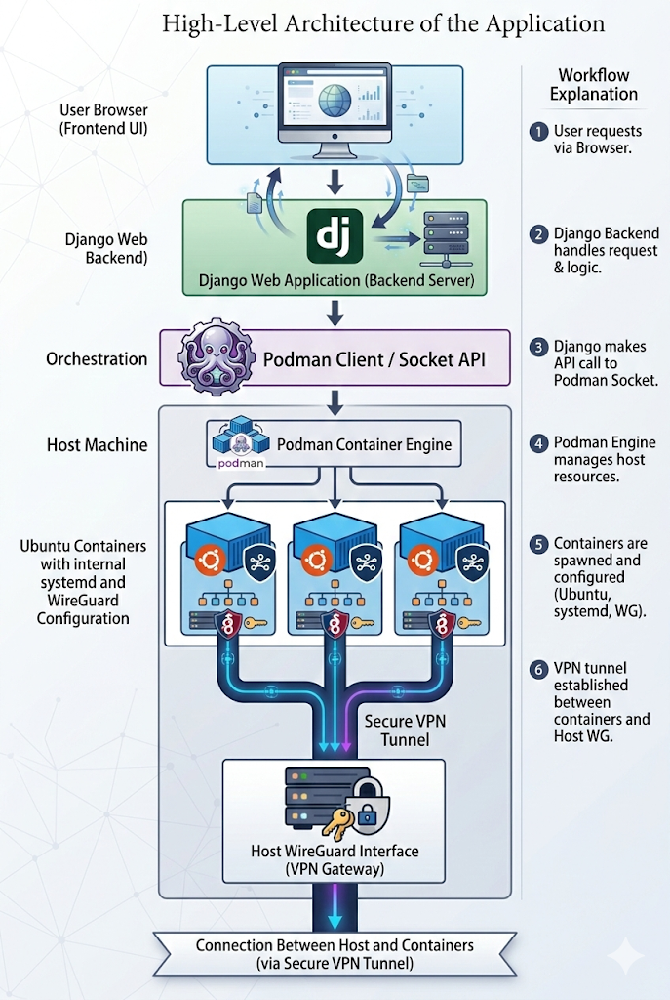

# Container Management Platform (with Wireguard Automation)

---

## Overview of the project

This project is a web-based container management platform built using **Django + Podman + Wireguard**.

It allows users to:

* Create and manage containers from the web browser
* Automatically configure the Wireguard networking in containers
* Access container's terminal from web UI
* View live container logs
* Monitor container status in real time
* Auto-start containers after system reboot

---

## Project Structure
* The project is residing in:

```
mysite/
│
├── containers/
│   ├── models.py
│   ├── views.py
│   ├── consumers.py
│   ├── routing.py
│   ├── urls.py
│   ├── templates/
│
├── manage.py
└── settings.py
```

---

## High Level Architecture of the application

 

---

# 1. Authentication System

* For first time login, Users should Sign Up and log in to access the dashboard. And later you can use Sign in option.

* The users data will be stored in Django DB. To be specific it’s stored in db.sqlite3 file.

* In order to see the db.sqlite3 in VS code i recommend you to install an extension called “SQLite Viewer“.

### Preview of the page


---

# 2. Container Dashboard

1. So this is the main interface for managing our Podman-containers. Any containers that are already present on your machine will also be displayed here.

2. Functionalities provided in the dashboard :

* Creating new containers

* Start / Stop / Pause / Deleting the containers

* Open’s web-terminal for a specific container

* Can View logs for specific container

* View images present in our machine

* And a Logout option

### Preview of the page


3. When we create a new container from WEB-UI, by default the image used is UBUNTU.

4. The following packages are installed during container creation:

* Wireguard

* SSH

* Systemd

* Nano

---
## Now let’s look at some core functionalities:

## 1. Container Creation:

So how the container is creating when we click on create button?

—> When the user clicks the Create button in the web interface:

- A request is sent from the Frontend (Dashboard UI)  
- The request reaches the Django Backend  
- Django uses the Podman Python client / Podman CLI  
- A new container is created using a predefined image  
- Required packages (WireGuard, SSH, systemd, Nano) are already available inside the image  
- The container is started  
- WireGuard configuration is generated  
- The host peer configuration is updated  

Let’s see backend code how it got implemented. If you want full exact code you can refer to `views.py`.

```python
import podman
from django.shortcuts import redirect
from django.contrib.auth.decorators import login_required
from .models import Container

@login_required
def create_container(request):
    if request.method == "POST":
        container_name = request.POST.get("container_name")

        # Connect to Podman (rootless socket)
        client = podman.PodmanClient(
            base_url="unix:///run/user/1000/podman/podman.sock"
        )

        # Create container
        container = client.containers.create(
            image="ubuntu-systemd:latest",
            name=container_name,
            tty=True,
            stdin_open=True,
            privileged=True
        )

        # Start container
        container.start()

        # Save container info in database
        Container.objects.create(
            name=container_name,
            container_id=container.id,
            status="running"
        )

        return redirect("dashboard")
```


# 4. Browser Terminal

Interactive terminal connected directly to container shell using WebSockets.

If you want full code please refer to consumers.py
```python
class TerminalConsumer(AsyncWebsocketConsumer):

    async def connect(self):
        self.container_name = self.scope["url_route"]["kwargs"]["name"]
        await self.accept()
        self.master_fd, self.slave_fd = pty.openpty()
        self.process = subprocess.Popen(
            [
                "podman",
                "exec",
                "-it",
                self.container_name,
                "bash",
                "-i",
            ],
            stdin=self.slave_fd,
            stdout=self.slave_fd,
            stderr=self.slave_fd,
            preexec_fn=os.setsid,
        )
        os.close(self.slave_fd)
        await asyncio.sleep(0.2)
        os.write(
            self.master_fd,
            f'export PS1="root@{self.container_name}:\\w# "\n'.encode())
        self.read_task = asyncio.create_task(self.read_pty())

```
Understanding how it got implemented:

- The browser terminal is implemented using Django Channels and WebSockets to enable real-time communication between the browser and the backend.

- When a user opens the terminal for a container, the frontend connects to —> ws/terminal/<container_name>/, which is routed to TerminalConsumer class present in consumers.py

- Inside TerminalConsumer, the container name is extracted from the WebSocket URL.

- A pseudo-terminal (PTY) is created using pty.openpty() to simulate a real Linux terminal environment.

- The backend executes podman exec -it <container_name> bash -i using subprocess.Popen, attaching the shell to the PTY.

- The slave side of the PTY is connected to the container shell, while the master side is controlled by Django.

- When the user types a command in the browser, it is sent via WebSocket and written into the PTY using os.write().

- A background async task continuously reads shell output from the PTY using os.read() and streams it back to the browser in real time.

- A custom shell prompt (PS1) is dynamically set to show the container name, improving clarity and usability.

- When the WebSocket disconnects, the backend safely terminates the shell process and closes file descriptors to prevent resource leaks.

### Preview of the page


---

# 5. Logs Viewer

Real-time container logs streaming using WebSockets.
```python
class LogsConsumer(AsyncWebsocketConsumer):

    async def connect(self):
        self.container_name = self.scope["url_route"]["kwargs"]["name"]
        await self.accept()
        loop = asyncio.get_running_loop()
        history = await loop.run_in_executor(
            None,
            lambda: subprocess.check_output(
                ["podman", "logs", self.container_name],
                text=True
            ))
        await self.send(text_data=history)
        self.process = subprocess.Popen(
            ["podman", "logs", "-f", "--since", "1s", self.container_name],
            stdout=subprocess.PIPE,
            stderr=subprocess.STDOUT,
            text=True
        )
        asyncio.create_task(self.stream_logs())
    async def disconnect(self, close_code):
        if hasattr(self, "process"):
            self.process.kill()

    async def stream_logs(self):
        loop = asyncio.get_running_loop()

        while True:
            line = await loop.run_in_executor(
                None,
                self.process.stdout.readline
            )
            if not line:
                break
            await self.send(text_data=line)
```
Understanding how it got implemented:

- The Logs Viewer is implemented using Django Channels and WebSockets to stream logs in real time from containers to the browser.

- When the user opens the logs page, the frontend establishes a WebSocket connection to —> ws/logs/<container_name>/, which is routed to LogsConsumer class in consumers.py

- Inside connect(), the container name is extracted from the WebSocket URL so logs can be fetched dynamically for that specific container consumers

- First, the system fetches complete historical logs using → podman logs <container_name> and sends them immediately to the browser.

- Then, a continuous log-follow process is started using —> podman logs -f --since 1s <container_name>

- The -f flag enables live streaming mode, similar to tail -f, so new logs are captured in real time.

- The process output is connected to stdout=subprocess.PIPE, allowing Django to read log lines programmatically.

- An asynchronous background task (stream_logs) continuously reads new log lines using readline() and sends them instantly over WebSocket.

- Because this runs asynchronously, multiple users can view logs of different containers simultaneously without blocking the server.

- When the WebSocket disconnects, the running podman logs -f process is safely terminated to prevent resource leaks.

### Preview of the page


---

# 6. Wireguard Automation

Each container automatically receives:

* Unique VPN IP
* Private/Public key pair
* Peer configuration with host

Example network:

```
Host:        10.10.0.1
Container 1: 10.10.0.2
Container 2: 10.10.0.3
```

Wireguard config is dynamically rebuilt whenever containers are added or removed.

---

# 7. Overview of each file (what it does)

## a. models.py

This file defines the database structure used by the application.

Basically it contains the Container model, which stores networking information required for Wireguard configuration.

Fields

* name → Name of the container (unique)
* Wireguard_ip → Assigned VPN IP address
* public_key → Wireguard public key of the container

This database table acts as the source of truth for all Wireguard peer configurations.

---

## b. views.py

This is the main backend logic file and acts as the central controller of the application.

It handles both user interactions and system automation tasks.

This file is mainly responsible for:

* Authentication
* Container creation
* Container actions
* Wireguard setup
* Host Wireguard Rebuild
* Auto-start configuration

---

## c. consumers.py

This file implements WebSocket-based real-time communication using Django Channels.

There are three main consumers:

* TerminalConsumer → Provides an interactive terminal session inside the container.
* LogsConsumer → Streams real-time logs
* StatusConsumer → Continuously monitors container status.

---

## d. routing.py

This file defines WebSocket URL routes for Django Channels.

It maps WebSocket endpoints to the appropriate consumers.

Examples:

* /ws/terminal/<container_name>/
* /ws/logs/<container_name>/
* /ws/status/

This acts similarly to urls.py but for WebSockets instead of HTTP.

---

## e. urls.py

This file defines HTTP routes for the application.

It connects URLs with Django's view functions.

Routes Included

* Login page
* Dashboard page
* Logout endpoint
* Terminal page
* Logs viewer page

It serves as the entry point for all browser requests.

---

## f. apps.py

This file registers the Django application configuration. i.e It informs Django about the existence of the containers app.

---

## g. admin.py

This file is used to connect the database models to the Django admin panel. If we register models here, we can view and manage the data from the admin website.

---

## h. Templates Folder (Frontend UI)

The templates folder contains HTML files responsible for rendering the user interface.

* auth.html  —> This file provides the authentication interface for the application.
* dashboard.html —> This is the main user interface of the platform. t provides container management functionality.
* logs.html —> This page displays container logs in real time.
* terminal.html —> This file provides the browser-based terminal interface. And It uses Xterm.js to simulate a Linux terminal in the browser.

---

## i. static Folder

The static folder contains frontend assets used by the templates.

Typical contents include:

* Images (logo, icons)
* CSS files
* JavaScript files
* Fonts

But in our case we only used it for Images.

---

# 8. Autostart of the containers

The application implements an automatic container startup mechanism to ensure that all previously created containers are restored and running after a host system reboot, without requiring any manual intervention.

This functionality is achieved using systemd user services generated by Podman.

---

# 9. Technologies Used

| Technology      | Purpose           |
| --------------- | ----------------- |
| Django          | Web framework     |
| Podman          | Container engine  |
| Wireguard       | Secure networking |
| Django Channels | WebSockets        |
| Xterm.js        | Browser terminal  |
| SQLite          | Database          |
| systemd         | Auto-start        |

---

# Additional Technical Details

### Container Runtime

The project uses **Podman (rootless containers)** instead of Docker, which provides better security and does not require a daemon running with root privileges.

### Networking Model

Each container connects to the host through a **Wireguard VPN tunnel**, creating a private secure network between:

* Host machine
* Containers

### Real-Time Communication

Real-time features such as terminal access and logs streaming are implemented using:

* WebSockets
* Django Channels
* Async Consumers

This avoids page refresh and improves user experience.

---

# 10. System Requirements

* Python 3.10+
* Git
* Podman
* Linux (Ubuntu/Kubuntu recommended)
* Wireguard
* SSH

---

# 11. Installation Steps

## Install Dependencies

```
sudo apt update
sudo apt install git python3 python3-venv python3-pip podman -y
```

## Start Podman Socket

```
systemctl --user start podman.socket
systemctl --user enable podman.socket
```

## Clone Repository

```
git clone https://github.com/manumanas/Django-podman-containers
cd Django-podman-containers
```

## Create Virtual Environment

```
python3 -m venv venv
source venv/bin/activate
```

## Install Python Requirements

```
pip install -r requirements.txt
```

## Database Migration

```
python manage.py migrate
```

## Building the image: 
Note: we need to change the directory to the directory that has Containerfile in it.

```
podman build -t ubuntu-systemd -f ubuntu-systemd/Containerfile ubuntu-systemd/
```

## Run Application (Daphne)

```
daphne -b 127.0.0.1 -p 8000 mysite.asgi:application
```

Open browser:

```
http://127.0.0.1:8000
```

---
